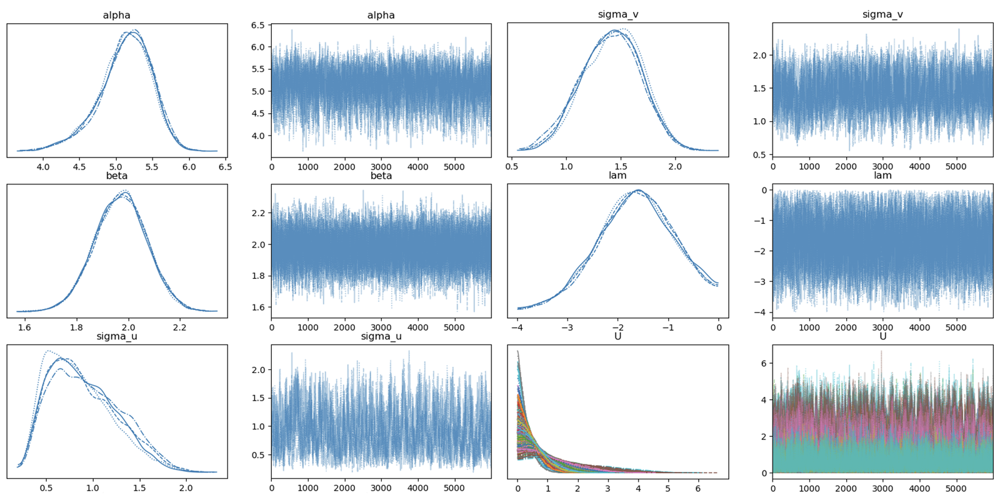
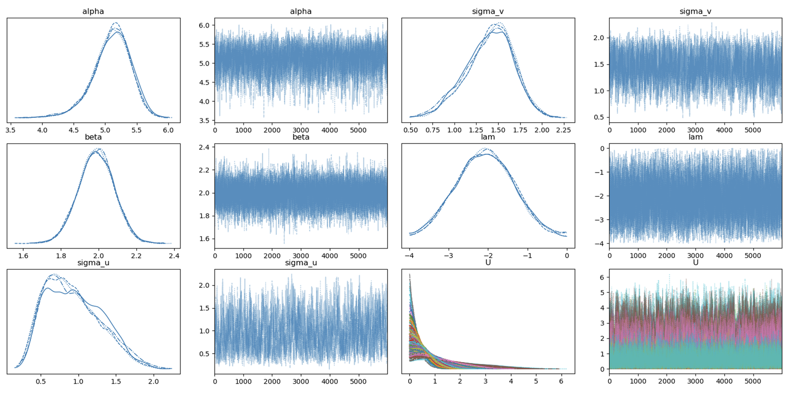
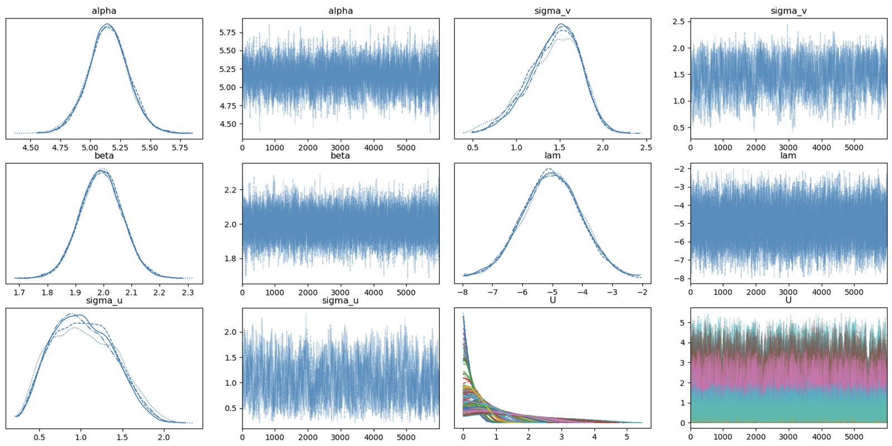

# Bayesian Stochastic Frontier Models (SN-HN) with PyMC

This repository provides an implementation of Bayesian stochastic frontier models under the **Skew-Normal – Half-Normal (SN-HN)** error structure, as described in:

> **Wei et al. (2025)**  
> "Bayesian stochastic frontier models under the skew-normal half-normal settings"  
> _Journal of Productivity Analysis_  
> [DOI: 10.1007/s11123-025-00757-3](https://doi.org/10.1007/s11123-025-00757-3)

---

## 📌 Overview

This project presents:

- Bayesian estimation for SN-HN stochastic frontier models using PyMC.
- Full derivation and implementation of Gibbs + Metropolis-Hastings sampling.
- Simulation-based evaluation under varying skewness levels (λ).
- Technical efficiency (TE) estimation with uncertainty quantification.
- Comparison with frequentist MLE methods (Nelder-Mead and ECM).
- Real data analysis using the 1994 NBER manufacturing dataset.

---

## 🧠 Model Structure

The stochastic frontier model is specified as:

$$
Y_i = \beta_0 + \beta_1 x_{i1} + \dots + \beta_k x_{ik} + V_i - U_i
$$

-  $V_i \sim \text{SkewNormal}(0, \sigma_v^2, \lambda$) 
- $U_i \sim \text{HalfNormal}(0, \sigma_u^2$)

We use log-transformed Cobb-Douglas specifications and evaluate the posterior of parameters and inefficiency terms via MCMC.

---

## 📁 Repository Structure

```
.
├── data/                   # Simulated and real datasets
├── notebooks/              # Per-lambda simulation runs (0.5 to 5)
├── figures/                # Posterior TE plots (uploaded separately)
├── src/                    # Model code and utilities (PyMC)
├── requirements.txt        # Python environment
└── README.md               # This file
```

---

## 🔬 Experiments

We evaluate model behavior under five levels of skewness:

| λ       | Notebook Filename                | Description             |
|---------|----------------------------------|--------------------------|
| −0.5    | `Final-lam-0.5_simplified.ipynb` | Mild skew                |
| −1.0    | `Final-lam-1_simplified.ipynb`   | Moderate skew            |
| −1.5    | `Final-lam-1.5_simplified.ipynb` | Strong skew              |
| −2.0    | `Final-lam-2_simplified.ipynb`   | Heavy skew               |
| −5.0    | `Final-lam-5_simplified.ipynb`   | Extreme skew (hard case) |

Each notebook includes:

- Posterior traceplots and density plots
- Inference results for α, β, σ_v, σ_u, λ
- RMSE comparisons for Skew-Normal vs Normal
- Posterior distribution of technical efficiency (TE)
- MCMC convergence diagnostics

---

## 📈 Technical Efficiency (TE) Results

Posterior distributions of TE scores across different skewness levels (λ):

| λ       | Posterior TE Boxplot |
|---------|----------------------|
| −0.5    |  |
| −1.0    |    |
| −1.5    |  |
| −2.0    |    |
| −5.0    |    |

These plots demonstrate how skewness affects the TE posterior. As λ becomes more negative, the posterior spreads wider—highlighting increased uncertainty and the importance of using a skew-normal likelihood.

---

## ✅ Key Findings

- The Bayesian SN-HN model yields significantly lower RMSE values for all parameters compared to MLE (including λ and inefficiency term \( u \)).
- TE distributions under SN-HN models are more realistic and robust under skewed error settings.
- Posterior sampling shows well-mixed traces for all parameters, with clear differences in posterior shapes between models.
- SN-HN models outperform Normal-based SFM in terms of DIC (Deviance Information Criterion).

---

## 💻 Setup

To install dependencies:

```bash
pip install -r requirements.txt
```

Run simulations:

```bash
# Example: run simulation with λ = -1.5
jupyter notebook notebooks/Final-lam-1.5_simplified.ipynb
```

---

## 📄 Citation

If you use this code, please cite:

```bibtex
@article{wei2025bayesian,
  title={Bayesian stochastic frontier models under the skew-normal half-normal settings},
  author={Wei, Zheng and Choy, S.T. Boris and Wang, Tonghui and Zhu, Xiaonan},
  journal={Journal of Productivity Analysis},
  year={2025},
  doi={10.1007/s11123-025-00757-3}
}
```

---

## 📬 Contact

For academic questions:  
📧 [zheng.wei@tamucc.edu](mailto:zheng.wei@tamucc.edu)
