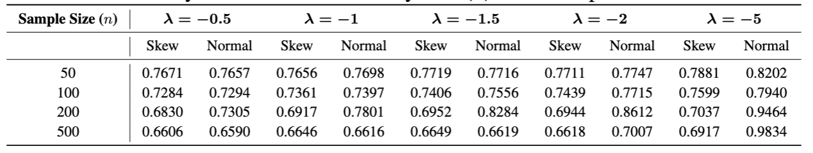

# Bayesian Stochastic Frontier Models (SN-HN) with PyMC

This repository provides an implementation of Bayesian stochastic frontier models under the **Skew-Normal – Half-Normal (SN-HN)** error structure, as described in:

> **Wei et al. (2025)**  
> "Bayesian stochastic frontier models under the skew-normal half-normal settings"  
> _Journal of Productivity Analysis_  
> [DOI: 10.1007/s11123-025-00757-3](https://doi.org/10.1007/s11123-025-00757-3)

---

## 📌 Overview

Our contributions are threefold:

- replicate the SN-HN stochastic frontier model in PyMC, providing an accessible and transparent implementation for Python users
- apply the model to simulated production data generated from a SN-HN distribution and evaluate the model’s performance using posterior analysis
- compare the performance of proposed by (Wei et al., 2025) which employs a skew-normal likelihood with that of a conventional model based on a normal likelihood to assess the impact of distributional asymmetry on posterior
inference.


## 🧠 Model Structure

The stochastic frontier model is specified as:

$$
Y_i = \alpha + \beta X + V - U
$$

- $Y$ represents the logarithm of the output variable
- $X$ denotes the logarithm of a single explanatory variable
- $\alpha$ is the intercept, $β$ is the regression coefficient
- $U$ represents the inefficiency error term
- $V$ is the measurement error term
- $\xi$ is the location parameter

$$
X \sim N(1,1)\\
U \sim HN(0,\sigma_u^2)\\
Y \sim SN(\xi,\sigma_v^2,\lambda)\\
\xi = \alpha + \beta X - U
$$

The true parameter values used in simulation are:
$\alpha= 5, β = 2, σ_u = 1, σ_v = 1.5$


### Prior Distributions
For the Bayesian analysis, we adopt the following prior distributions:

$$
\alpha \sim N(\mu_\alpha, \sigma_\alpha^2)\\
\beta \sim N(\mu_\beta, \sigma_\beta^2)\\
\sigma_v^2 \sim IG(\alpha_v,\beta_v)\\
\sigma_u^2 \sim IG(\alpha_u,\beta_u)\\
\lambda = \sim TN(\mu_\lambda,\sigma_\lambda^2;a,b)\\
$$


To assess the robustness of posterior inference for λ, we simulate data across the following
scenarios:
- Skewness values: λ∈{−0.5,−1,−1.5,−2,−5}
- Sample sizes: n∈{50,100,200,500}

This results in a total of 20 simulation scenarios. For each scenario, nsynthetic observations
are generated and used as input for Bayesian inference.


---

## 📁 Repository Structure

```
.
├── Notebooks/              # Per-lambda simulation runs (0.5 to 5)
├── Figures/                # Posterior TE plots (uploaded separately)
├── Output/                # All result outputs from the experiments, including:
│   ├── 1.posterior summaries     # Posterior parameter summaries (mean, sd, etc.)
│   ├── 2.traceplots              # Traceplots and posterior distributions
│   ├── 3.loo                     # Leave-One-Out cross-validation results
│   ├── 4.rmse_param              # RMSE for estimated model parameters
│   ├── 5.y_pred_rmse            # RMSE for predicted y values
│   ├── 6.inefficiency_rmse      # RMSE for inefficiency term (u)
├── Docs/                  # Project report (PDF) summarizing the Bayesian stochastic frontier modeling approach, results, and key findings
├── LICENSE                    # MIT License
├── requirements.txt        # Python environment
└── README.md               # This file
```

---

## 🔬 Experiments

We evaluate model behavior under five levels of skewness:

| λ       | Notebook Filename                | Description             |
|---------|----------------------------------|--------------------------|
| −0.5    | `Final-lam-0.5_simplified.ipynb` | Mild skew                |
| −1.0    | `Final-lam-1_simplified.ipynb`   | Moderate skew            |
| −1.5    | `Final-lam-1.5_simplified.ipynb` | Strong skew              |
| −2.0    | `Final-lam-2_simplified.ipynb`   | Heavy skew               |
| −5.0    | `Final-lam-5_simplified.ipynb`   | Extreme skew (hard case) |

Each notebook includes:

- Posterior traceplots and density plots
- Inference results for $\alpha, \beta, \sigma_v, \sigma_u, \lambda$
- RMSE comparisons for Skew-Normal vs Normal
- Posterior distribution of technical efficiency (TE)
- MCMC convergence diagnostics

---

## 📈 Technical Efficiency (TE) Results

Posterior distributions of TE scores across different skewness levels (λ):

| λ       | Posterior TE Boxplot |
|---------|----------------------|
| −0.5    |  |
| −1.0    |    |
| −1.5    |  |
| −2.0    |    |
| −5.0    |    |

These plots demonstrate how skewness affects the TE posterior. As λ becomes more negative, the posterior spreads wider—highlighting increased uncertainty and the importance of using a skew-normal likelihood.

---

### 📊 RMSE Table for Inefficiency Term (u)




## ✅ Key Findings

- Wei et al’s Bayesian linear model with a skew-normal half-normal likelihood performs comparably to the standard normal model across LOO and RMSE metrics.
- For λ far from zero (e.g., −1.5, −2, −5), the Wei et al. model predicts parameter values and inefficiency more accurately using the posterior mean prediction.
- This is shown by lower RMSE in posterior mean inefficiency and parameter estimates compared to the model using the normal likelihood.
---

## 💻 Setup

To install dependencies:

```bash
pip install -r requirements.txt
```

Run simulations:

```bash
# Example: run simulation with λ = -1.5
jupyter notebook notebooks/Final-lam-1.5_simplified.ipynb
```

---

## 📄 Citation

If you use this code, please cite:

```bibtex
@article{wei2025bayesian,
  title={Bayesian stochastic frontier models under the skew-normal half-normal settings},
  author={Wei, Zheng and Choy, S.T. Boris and Wang, Tonghui and Zhu, Xiaonan},
  journal={Journal of Productivity Analysis},
  year={2025},
  doi={10.1007/s11123-025-00757-3}
}
```
---

## 📄 License

This project is licensed under the MIT License. See the [LICENSE](LICENSE) file for details.

---

## 📬 Contact

For academic questions:  
📧 [zheng.wei@tamucc.edu](mailto:zheng.wei@tamucc.edu)
📧 [zzapata2@tamucc.edu](mailto:zzapata2@tamucc.edu)
📧 [cliu7@tamucc.edu](mailto:cliu@tamucc.edu)
📧 [yhwang@tamucc.edu](mailto:yhwang@tamucc.edu)

